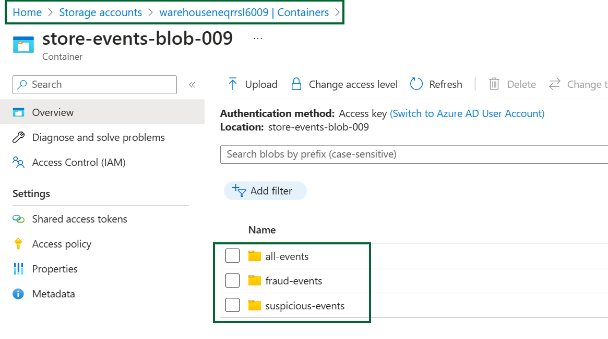

# Event Stream Analysis with Azure Stream Analytics

Mystique enterprise's web stores generate a high volume of sales and inventory events from various locations. Their goal is to process these events in real-time and detect potential fraudulent activity. Specifically, they aim to identify events with a very high discount (`>50%`) and where `priority_shipping` has been requested for a `sale_event`. These events need to be processed separately to ensure thorough analysis and fraud detection.

Below is a sample of their event. How can we assist them?

```json
{
  "id": "2a3fda24-1c6b-4b93-8a8a-cc97097ec08a",
  "event_type": "sale_event",
  "store_id": 7,
  "store_fqdn": "localhost",
  "store_ip": "127.0.0.1",
  "cust_id": 225,
  "category": "Groceries",
  "sku": 44848,
  "price": 68.84,
  "qty": 63,
  "discount": 60,
  "gift_wrap": true,
  "variant": "red",
  "priority_shipping": false,
  "payment_method": "cod",
  "ts": "2023-06-06T20:24:45.754948",
  "contact_me": "github.com/miztiik",
  "is_return": 
}
```

Event properties,

```json
{
   "event_type":"sale_event",
   "priority_shipping":false,
}
```

 Can you provide guidance on how to accomplish this?

## 🎯 Solution

To identify potential fraudulent activity, Miztiik Enterprises can utilize [Azure Stream Analytics][1] in their data processing pipeline. Here's how it works:

- **Event Producer**: Azure Functions: Miztiik Enterprises employs an Azure Functions-based producer to simulate store events and ingest them into Azure Event Hub.

- **Data Persistence**: The event stream is configured to persist all events in both a blob storage and Cosmos DB for audit and archival purposes.

- **Stream Analytics Query**: We will use Azure Stream Analytics [query written in T-SQL][2] to select events based on specific criteria. They identify events with a high discount (`>50%`) and those where `priority_shipping` is requested for a `sale_event`.

- **Event Processing**: The selected events meeting the criteria are sent to a queue and persisted in a separate blob storage location. Lets call it `suspicious-events`. This allows us to focus on relevant data for analysis and decision-making.

- **Fraud Analyzer**: A trigger on the queue activates an Azure Function, which inspects the event and stores it in another blob location or performs additional processing as required, such as sending an email notification to the fraud team etc., In our case, we will simply persist the event in a separate blob location. Lets call it `fraud-events`.

- **Fraudulent Event Reconciliation**: By comparing the events stored in the original "all events" blob with those in the fraud events blob, Miztiik Enterprises can effectively reconcile and identify fraudulent events using SQL queries for quick analysis and investigation.

By leveraging Azure Stream Analytics and the described processing flow, Miztiik Enterprises can efficiently detect and handle potential fraudulent events while ensuring data auditability and providing query capabilities for fraud analysis.


1. ## 🧰 Prerequisites

   This demo, along with its instructions, scripts, and Bicep template, has been specifically designed to be executed in the `northeurope` region. However, with minimal modifications, you can also try running it in other regions of your choice (the specific steps for doing so are not covered in this context)

   - 🛠 Azure CLI Installed & Configured - [Get help here](https://learn.microsoft.com/en-us/cli/azure/install-azure-cli)
   - 🛠 Azure Function Core Tools - [Get help here](https://learn.microsoft.com/en-us/azure/azure-functions/functions-run-local?tabs=v4%2Cwindows%2Ccsharp%2Cportal%2Cbash#install-the-azure-functions-core-tools)
   - 🛠 Bicep Installed & Configured - [Get help here](https://learn.microsoft.com/en-us/azure/azure-resource-manager/bicep/install)
     - 🛠 [Optional] VS Code & Bicep Extenstions - [Get help here](https://learn.microsoft.com/en-us/azure/azure-resource-manager/bicep/install#vs-code-and-bicep-extension)
   - `jq` - [Get help here](https://stedolan.github.io/jq/download/)
   - `bash` or git bash - [Get help here](https://git-scm.com/downloads)

1. ## ⚙️ Setting up the environment

   - Get the application code

     ```bash
     git clone https://github.com/miztiik/azure-event-hub-stream-processor.git
     cd azure-event-hub-stream-processor
     ```

1. ## 🚀 Prepare the local environment

   Ensure you have jq, Azure Cli and bicep working

   ```bash
   jq --version
   func --version
   bicep --version
   bash --version
   az account show
   ```

1. ## 🚀 Deploying the Solution

   - **Stack: Main Bicep**
     We will create the following resources
     - **Storage Accounts** for storing the events
       - General purpose Storage Account - Used by Azure functions to store the function code
       - `warehouse*` -  Azure Function will store the events data in this storage account
     - **Event Hub Namespace**
       - Event Hub Stream, with `4` Partitions
         - Even Partitions - `0` & `2` - `inventory_Event`
         - Odd Partitions - `1` & `3` - `sale_event`
         - Event Hub Capture - Enabled
           - Events will be stored in `all-events` container.
     - **Managed Identity**
        - This will be used by the Azure Function to interact with the service bus, Event HUB and Storage Accounts
     - **Azure Stream Analytics**
        - **Input**: Event Hub Stream
        - **Outputs**
          - Service Bus Queue
          - Blob Storage - `suspicious-events`
        - **Query**: T-SQL Query to filter events based on `priority_shipping` and `discount` criteria and sent to the two outputs. Here we are using a tumbling window of `5` minutes to group the events and identify the fraudulent order ids. The query looks like this,

            ```sql
            SELECT 
               store_id, 
               COLLECT(id) as ids, 
               System.Timestamp() as WindowEnd, 
               DATEADD(minute, -5, System.Timestamp()) as WindowStart
            INTO [fraud-detective-output-008]
            FROM [fraud-detective-input-008]
            WHERE 
               [discount] > 50
               AND [priority_shipping] = 1
               AND [event_type] = 'sale_event'
            GROUP BY store_id, TumblingWindow(minute, 5)
            ```

            A typical response would look like this,

            ```json
            [
               {
                  "store_id": 6,
                  "ids": [
                        "e6a99071-2309-4c7f-b2e9-cd4236ae4e4a",
                        "a69322f7-e6b0-4bdf-9021-6ca44da87d9e",
                        "0d262ed4-7935-4a37-afce-88c9d615a182"
                  ],
                  "WindowEnd": "2023-06-07T10:10:00.0000000Z",
                  "WindowStart": "2023-06-07T10:05:00.0000000Z"
               },
               {
                  "store_id": null,
                  "ids": [
                        "d2cbbd5c-6094-4b4d-9dd5-2f97087a9eaa",
                        "4fda910e-4c15-4364-a5b8-d369d069c4de",
                        "822d15ab-57d8-48f4-8052-7f7258021f79",
                        "a8d1ab2a-7b28-46fc-bb35-c86cd7f52dc8",
                        "1970147b-9794-4b15-99c9-2ac0d1c9880f"
                  ],
                  "WindowEnd": "2023-06-07T10:10:00.0000000Z",
                  "WindowStart": "2023-06-07T10:05:00.0000000Z"
               }
            ]
            ```

     - **Python Azure Functions**
        - **Producer**: `HTTP` Trigger. Customized to send `count` number of events to the service bus, using parameters passed in the query string. `count` defaults to `10`
        - **Consumer aka Fraud Analyzer**: `Service Bus Trigger` trigger for an incoming message. It is configured to receive `1` message at a time. The message is then stored in the `fraud-events` container in the `warehouse*` storage account.
     - _Note: There are few additional resources created, but you can ignore them for now, they aren't required for this demo, but be sure to clean them up later_

      Initiate the deployment with the following command,

      ```bash
      # make deploy
      sh deployment_scripts/deploy.sh
      ```

      After successfully deploying the stack, Check the `Resource Groups/Deployments` section for the resources.

      
      
      

1. ## 🔬 Testing the solution

   - **Starting the Stream Analytis Job**

      As of Q2-2023, Stream analytics jobs can be started from portal, powershell or from Visual Studio Code. We will use the portal to start the job.

      
      

   - **Trigger the function**

      ```bash
      PRODUCER_URL="https://fraud-analytics-store-backend-ne-fn-app-008.azurewebsites.net/store-events-producer-fn"
      for i in {1..100}
      do
      echo "Sending event batch $i"
      curl $PRODUCER_URL?count=30 &
      sleep 5
      done
      ```

      You should see an output like this, We are sending batch of 30 events every 5 seconds. You can change the batch size and the interval between batches by changing the `count` and `sleep` parameters respectively.

      ```json
      Sending event batch 1
      [1] 2814
      Sending event batch 2
      [2] 2816
      Sending event batch 3
      [3] 2818
      Sending event batch 4
      ...
      ```

      
      
      

      If everything works as expected, we should start seeing some events in the `suspicious-events` and  `fraud-events` container in the `warehouse*` storage account.

      
      
      
      

      We can reconcile if the event details by using the event id from the `suspicious-events` container and the `fraud-events` container and make a querty against the cosmos db.
      

1. ## 📒 Conclusion

   In this demo, Miztiik Enterprises successfully utilized Azure Stream Analytics, Azure Functions, Azure Event Hub, blob storage, and Cosmos DB to process a high volume of sales and inventory events from their web stores. By filtering and selecting events based on specific criteria, they identified potential fraudulent activity and stored the events in separate blob locations for further inspection. The reconciliation of events in the original "all events" blob with those in the fraud events blob enabled efficient fraud detection and analysis. This demo exemplifies the seamless integration of Azure services to enhance fraud detection processes and improve data auditability.
  
1. ## 🧹 CleanUp

   If you want to destroy all the resources created by the stack, Execute the below command to delete the stack, or _you can delete the stack from console as well_

   - Resources created during [Deploying The Solution](#-deploying-the-solution)
   - _Any other custom resources, you have created for this demo_

   ```bash
   # Delete from resource group
   az group delete --name Miztiik_Enterprises_xxx --yes
   # Follow any on-screen prompt
   ```

   This is not an exhaustive list, please carry out other necessary steps as maybe applicable to your needs.

## 📌 Who is using this

This repository aims to show how to Bicep to new developers, Solution Architects & Ops Engineers in Azure.

### 💡 Help/Suggestions or 🐛 Bugs

Thank you for your interest in contributing to our project. Whether it is a bug report, new feature, correction, or additional documentation or solutions, we greatly value feedback and contributions from our community. [Start here](/issues)

### 👋 Buy me a coffee

[](https://ko-fi.com/Q5Q41QDGK) Buy me a [coffee ☕][900].

### 📚 References

1. [Azure Docs - Stream Analytics][1]
1. [Azure Docs - Stream Analytics Aggregation function][2]
1. [Azure Docs - Event Hub Python Samples][3]
1. [Azure Docs - Event Hub Explorer Tool][4]
1. [Azure Docs - Event Hub Partitions][5]
1. [Azure Docs - Managed Identity][8]
1. [Azure Docs - Managed Identity Caching][9]
1. [Gitub Issue - Default Credential Troubleshooting][10]
1. [Gitub Issue - Default Credential Troubleshooting][11]

[1]: https://learn.microsoft.com/en-us/azure/stream-analytics/stream-analytics-introduction
[2]: https://learn.microsoft.com/en-us/stream-analytics-query/aggregate-functions-azure-stream-analytics
[3]: https://github.com/Azure/azure-sdk-for-python/blob/main/sdk/eventhub/azure-eventhub/samples
[4]: https://techcommunity.microsoft.com/t5/azure-paas-blog/how-to-verify-if-azure-event-hub-partition-is-working-by-using/ba-p/3032371
[5]: https://learn.microsoft.com/en-us/azure/architecture/reference-architectures/event-hubs/partitioning-in-event-hubs-and-kafka
[8]: https://learn.microsoft.com/en-us/azure/active-directory/managed-identities-azure-resources/overview
[9]: https://learn.microsoft.com/en-us/azure/app-service/overview-managed-identity?tabs=portal%2Chttp#configure-target-resource
[10]: https://github.com/microsoft/azure-container-apps/issues/442
[11]: https://github.com/microsoft/azure-container-apps/issues/325#issuecomment-1265380377

### 🏷️ Metadata


**Level**: 200

[100]: https://www.udemy.com/course/aws-cloud-security/?referralCode=B7F1B6C78B45ADAF77A9
[101]: https://www.udemy.com/course/aws-cloud-security-proactive-way/?referralCode=71DC542AD4481309A441
[102]: https://www.udemy.com/course/aws-cloud-development-kit-from-beginner-to-professional/?referralCode=E15D7FB64E417C547579
[103]: https://www.udemy.com/course/aws-cloudformation-basics?referralCode=93AD3B1530BC871093D6
[899]: https://www.udemy.com/user/n-kumar/
[900]: https://ko-fi.com/miztiik
[901]: https://ko-fi.com/Q5Q41QDGK